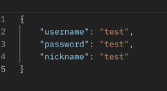
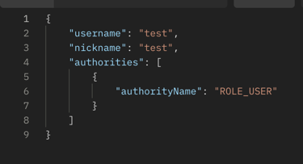
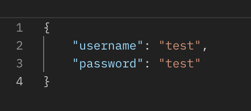
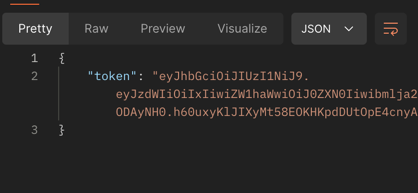
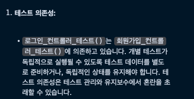
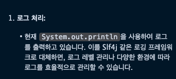

# 백엔드 개발 온보딩 과제 (Java)

## Done
✅ Junit를 이용한 테스트 코드 작성법 이해

✅ Spring Security를 이용한 Filter에 대한 이해

✅ JWT와 구체적인 알고리즘의 이해

✅ PR 날려보기

✅ EC2에 배포해보기

✅ EC2에 배포해보기

✅ 리뷰 바탕으로 개선하기

## Swagger URI
- http://52.78.11.161:8080/swagger-ui/index.html

## Signup Request


## Signup Response


## Sign Request


## Sign Response


## codeReview

### 개선사항 - 1


### 기존 - 1
```java
    @Test
    public void 로그인_컨트롤러_테스트() throws Exception {
        회원가입_컨트롤러_테스트();
        SignRequestDto dto = new SignRequestDto(
            "testUserName",
            "testPassword"
        );
        String stringDto = objectMapper.writeValueAsString(dto);
        mockMvc.perform(post("/api/v1/users/sign")
                    .contentType("application/json")
                    .content(stringDto)
            )
            .andExpect(MockMvcResultMatchers.status().isOk());
    }
```

### 개선 - 1
```java
    // 테스트를 위한 더미데이터 미리 생성
    @BeforeEach
    void init() {
        SignupRequestDto dto = new SignupRequestDto(
                "testUserName1",
                "testPassword1",
                "testNickname1"
        );
        userService.signUp(dto);
    }
```
```java
    @Test
    public void 로그인_컨트롤러_테스트() throws Exception {
        SignRequestDto dto = new SignRequestDto(
                "testUserName1",
                "testPassword1"
        );
        String stringDto = objectMapper.writeValueAsString(dto);
        mockMvc.perform(post("/api/v1/users/sign")
                        .contentType("application/json")
                        .content(stringDto)
                )
                .andExpect(MockMvcResultMatchers.status().isOk());
    }
```
- 개선후 각 테스트 코드가 독립적으로 시행되게 변경되었습니다

### 개선사항 - 2


### 기존 - 2
```java
    @Transactional
    public SignResponseDto sign(SignRequestDto dto) {
        User user = userRepository.findByUsername(dto.getUsername())
                .orElseThrow(() -> new IllegalArgumentException("유저가 존재하지 않습니다"));
        System.out.println(user.getPassword());
        System.out.println(dto.getPassword());

        if (!pe.matches(dto.getPassword(), user.getPassword())) {
            throw new IllegalArgumentException("유저의 정보가 일치하지 않습니다");
        }

        String token = jm.generateAccessToken(JwtDto.of(user));
        return SignResponseDto.of(token);
    }
```

### 개선 - 2
```java
    @Transactional
    public SignResponseDto sign(SignRequestDto dto) {
        User user = userRepository.findByUsername(dto.getUsername())
                .orElseThrow(() -> new IllegalArgumentException("유저가 존재하지 않습니다"));
        log.debug(dto.getPassword());
        log.debug(user.getPassword());

        if (!pe.matches(dto.getPassword(), user.getPassword())) {
            throw new IllegalArgumentException("유저의 정보가 일치하지 않습니다");
        }

        String token = jm.generateAccessToken(JwtDto.of(user));
        return SignResponseDto.of(token);
    }
```
- 로그 처리를 @Slf4j를 통하여 더욱 효율적으로 처리 할 수 있습니다


