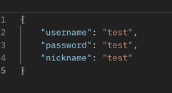
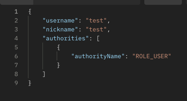
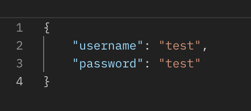
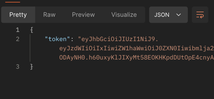

# 백엔드 개발 온보딩 과제 (Java)

## Done
✅ Junit를 이용한 테스트 코드 작성법 이해

✅ Spring Security를 이용한 Filter에 대한 이해

✅ JWT와 구체적인 알고리즘의 이해

✅ PR 날려보기

✅ EC2에 배포해보기

✅ EC2에 배포해보기

## To Do
☐  리뷰 바탕으로 개선하기

## Swagger URI
- http://52.78.11.161:8080/swagger-ui/index.html

## Signup Request

## Signup Response

## Sign Request

## Sign Response

